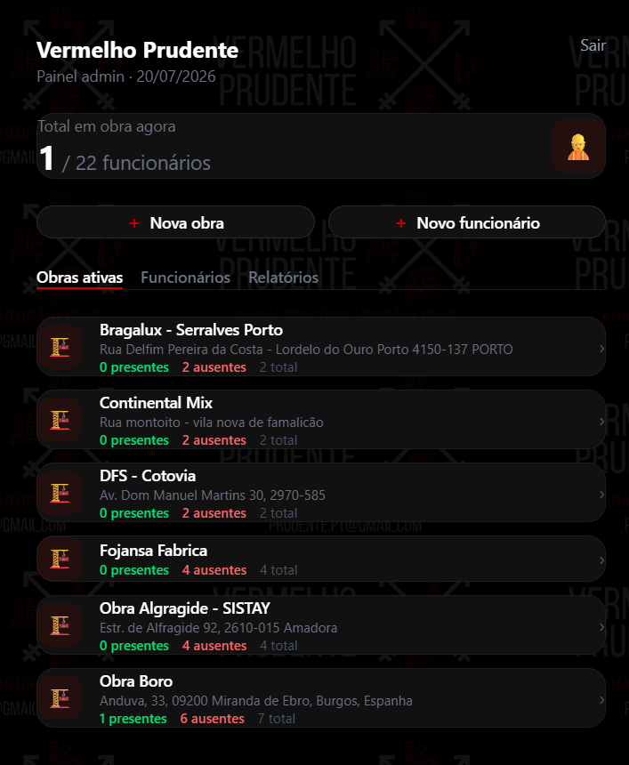

# Vermelho Prudente — Field Time Tracking

GPS-based time tracking app for a plumbing company with crews operating across Portugal and Spain.

**Live:** [vermelho-prudente.vercel.app](https://vermelho-prudente.vercel.app)

**Stack:** React · Vite · Tailwind CSS · Node.js · Express · Supabase (PostgreSQL + Auth + Storage) · Vercel · Render

<p align="center">
  
  &nbsp;&nbsp;
  
</p>

---

## What it does

- Workers clock in/out via GPS — only works within a configurable radius of the job site (Haversine formula, default 200m)
- Admin manages job sites, workers, pay slips and generates monthly PDF reports
- Two billing cycles: 26th→25th (Portugal) and 1st→last day (Spain), configurable per worker
- Installable PWA — the target audience uses Android on-site, not a laptop

---

## Technical decisions

**PWA instead of React Native**
The client has no budget for App Store distribution. An installable PWA covers the real use case (home screen icon, cached data offline) with zero distribution friction on both Android and iPhone.

**Nominatim (OpenStreetMap) instead of Google Maps**
Address-to-coordinates geocoding at zero cost with no credit card required. For this project's request volume (admin creates job sites occasionally), Nominatim's rate limit is never a concern.

**Separate frontend (Vercel) and backend (Render)**
The Supabase anon key can live in the frontend — it's public by design. But `createUser` and `deleteUser` require the service role key, which must never reach the client. The Express server exists solely for admin operations that require elevated Supabase permissions.

**Shared Supabase project with `vp_` prefix**
This app runs on the same Supabase instance as another client project. Instead of provisioning a second project, all tables are prefixed `vp_` for logical isolation. RLS policies enforce row-level access per authenticated user.

**jsPDF in-browser report generation**
Monthly reports were originally sent by email via Resend — this failed in production due to free-tier restrictions. Moved to client-side PDF generation: no external service dependency, instant download, 12-month history always available.

---

## Project structure

```
├── src/
│   ├── pages/
│   │   ├── admin/Dashboard.jsx       # job site management, workers, reports
│   │   └── funcionario/Ponto.jsx     # GPS clock-in/out
│   ├── components/admin/
│   │   ├── ObraModal.jsx             # real-time presence (30s polling)
│   │   ├── FuncionarioModal.jsx      # edit records + pay slip upload
│   │   ├── RelatoriosMensais.jsx     # PDF generation with jsPDF
│   │   └── RegistoManualModal.jsx    # admin override for missed clock-ins
│   └── utils/
│       ├── gps.js                    # Haversine distance calculation
│       └── horas.js                  # 30-min rounding + billing period logic
└── server/
    └── routes/
        ├── funcionarios.js           # createUser / deleteUser with service key
        └── relatorio.js              # email endpoint (Resend)
```

---

## Local setup

```bash
# Frontend
npm install
npm run dev

# Backend
cd server
npm install
node index.js
```

Frontend env vars (`.env.local`):
```
VITE_SUPABASE_URL=
VITE_SUPABASE_ANON_KEY=
```

Backend env vars (`server/.env`):
```
SUPABASE_URL=
SUPABASE_SERVICE_KEY=
RESEND_API_KEY=
EMAIL_ADMIN=
PORT=3001
```

---

Built by [Gabriel Tolin](https://github.com/GabrielTolin)
